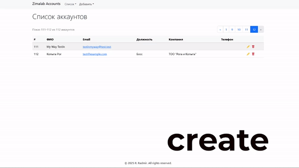

# Интерфейс управления аккаунтами клиентов

Этот проект предоставляет веб-интерфейс для управления учетными записями, позволяющий пользователям **добавлять, редактировать, удалять и выводить учетные записи** с разбивкой на страницы.

## Демонстрация

## Установка

При разработке использовались [PHP 8.4.3](https://windows.php.net/downloads/releases/php-8.4.3-Win32-vs17-x64.zip), [MySQL 8.4.4](https://cdn.mysql.com//Downloads/MySQL-8.4/mysql-8.4.4-winx64.msi), [Apache 2.4](https://www.apachelounge.com/download/VS17/binaries/httpd-2.4.63-250122-win64-VS17.zip) (Windows x64).

1. Склонируйте этот репозиторий и настройте веб-сервер так, чтобы корневой каталог указывал на директорию `public/`
2. При необходимости, скорректируйте константу `BASE_URL` в модуле `config.php`
3. Добавьте базу данных в ваш сервер MySQL согласно схеме в `db.sql`
4. При необходимости, скорректируйте соединение с MySQL в модуле `db_config.php`

### Дополнительные материалы

Настройка сервера Apache для

* [Windows](https://metanit.com/php/tutorial/1.3.php)
* [Mac](https://metanit.com/php/tutorial/1.5.php)
